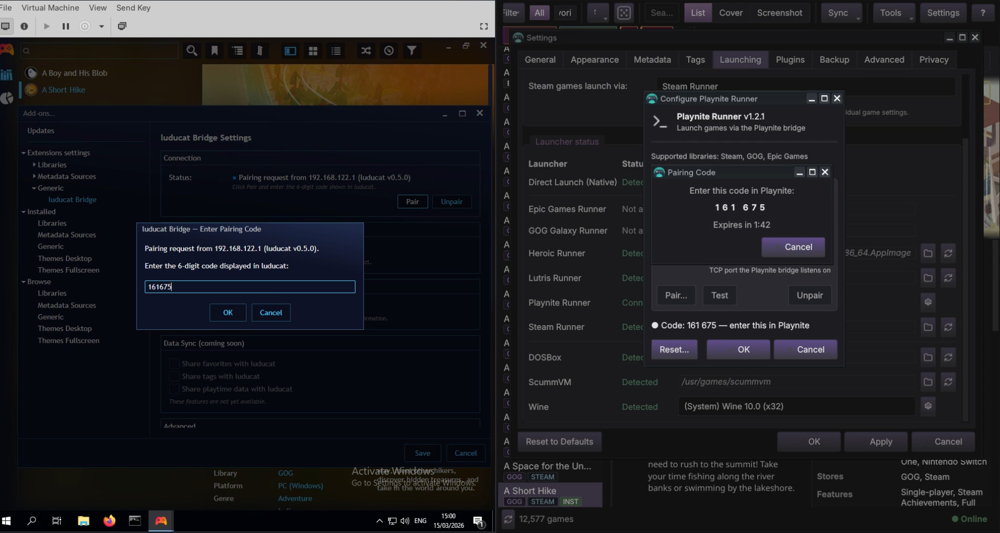
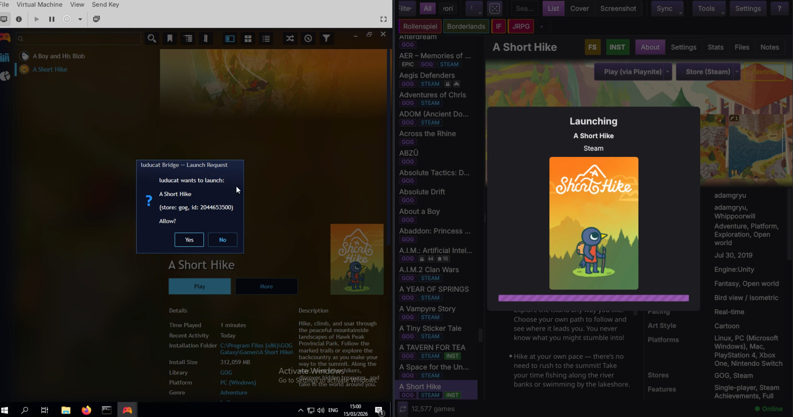
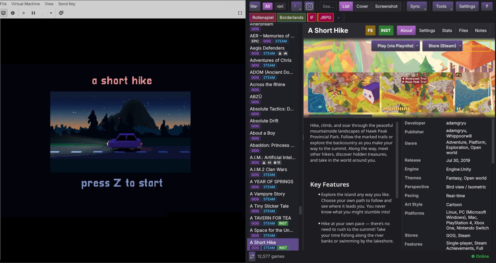

# luducat Bridge

Remote game launching bridge between [luducat](https://github.com/luducat/luducat)
and [Playnite](https://playnite.link/).

## What Is luducat?

[luducat](https://github.com/luducat/luducat) is a cross-platform game catalogue
browser that aggregates games from Steam, GOG, Epic, and other stores into a
unified browsing interface. It focuses on cataloguing and organization — all data
stays local, no telemetry, no cloud dependencies. Game launching is delegated to
native platform launchers (Steam, Heroic, etc.) or, via this bridge, to Playnite.

## What This Does

luducat Bridge is a Playnite plugin that enables remote game launching from
luducat to Playnite over the local network. After securing an encrypted channel
and bonding both applications, games can be started by library name and game ID.

This works in any direction:

- **Linux to Windows** — browse your catalogue on Linux, launch Windows games
  via Playnite
- **Windows to Windows** — run luducat and Playnite on separate Windows machines
- **Same machine** — luducat and Playnite on the same Windows host (localhost)

Only the game library name and game ID are transmitted — no credentials, no game
data, no personal information crosses the wire.

## Demo

## Screenshots

### Pairing
Both sides during the pairing handshake — Playnite bridge settings with code
entry (left) and luducat pairing code dialog (right):

### Starting
Launch confirmation dialog on Playnite with luducat's "Launching" overlay:

### Running
The game running on Windows (left), launched from luducat on Linux (right):

## How It Works

- Communication secured via **TLS 1.3** with **ECDSA P-256** key exchange
- Session management via **HMAC-TOTP** (silent reconnect without re-pairing)
- Restricted to **RFC 1918 private addresses** (LAN only, no WAN exposure)
- Pairing secrets and TLS certificates stored in **Windows Credential Manager**
  (DPAPI-protected) via
  [AdysTech.CredentialManager](https://github.com/AdysTech/CredentialManager)

## Playing Windows Games from Linux

The bridge is one half of a complete Linux-to-Windows game streaming setup.
Combined with game streaming software, you can browse your entire catalogue on
Linux, launch a Windows game with one click, and stream it back to your Linux
desktop:

### What You Need

| Machine | Software |
|---------|----------|
| **Linux** (your desktop) | luducat with Playnite Runner plugin enabled |
| **Linux** (your desktop) | [Moonlight](https://github.com/moonlight-stream/moonlight-qt) (game stream client) |
| **Windows** (gaming PC / VM) | Playnite with luducat Bridge installed |
| **Windows** (gaming PC / VM) | [Sunshine](https://github.com/LizardByte/Sunshine) (game stream host) |

### The Flow

1. **Browse** your game catalogue in luducat on Linux
2. **Launch** a game — luducat sends the launch command to Playnite via the bridge
3. **Playnite** starts the game on the Windows machine
4. **Sunshine** captures the game and streams it over your network
5. **Moonlight** displays the stream on your Linux desktop

This gives you a seamless experience: a native Linux catalogue browser with
full access to your Windows game library, without needing to switch desks or
remote into the Windows machine manually.

### Setup

1. Install and configure [Sunshine](https://github.com/LizardByte/Sunshine) on
   your Windows machine
2. Install and configure [Moonlight](https://github.com/moonlight-stream/moonlight-qt)
   on your Linux machine, pair it with Sunshine
3. Install luducat Bridge in Playnite (see Installation below)
4. Enable the Playnite Runner plugin in luducat (Settings > Launching)
5. Pair luducat with Playnite using the pairing code
6. Open your Moonlight stream, then launch games from luducat

## Requirements

- [Playnite](https://playnite.link/) (Windows)
- [luducat](https://github.com/luducat/luducat) 0.5.0+ with the Playnite Runner
  plugin enabled
- Both machines on the same local network (or localhost)

## Windows Firewall

On first connection, Windows may show a firewall prompt for Playnite. Allow it
on **Private networks** to enable bridge communication.

If pairing or launching fails with no obvious error:

1. Open **Windows Settings > Privacy & Security > Windows Security > Firewall
   & network protection > Allow an app through firewall**
2. Find **Playnite** in the list and ensure it is allowed on **Private** networks
3. If Playnite is not listed, click **Allow another app** and browse to
   `Playnite.DesktopApp.exe`

The bridge listens on a configurable TCP port (default: 52836) and only accepts
connections from RFC 1918 private addresses.

## Installation

**Via Playnite:** Add-ons browser > search "luducat Bridge" > Install

**Manual:** Download the `.pext` file from
[GitHub Releases](https://github.com/luducat/luducat-bridge/releases), then
drag it onto the Playnite window or place it in Playnite's Extensions directory.

## License

[MIT](LICENSE)

## Contributing

See [CONTRIBUTING.md](CONTRIBUTING.md) for guidelines.

## Development Disclosure

This plugin was developed with AI-assisted tooling. See
[CONTRIBUTING.md](CONTRIBUTING.md) for details on what that means in practice.
